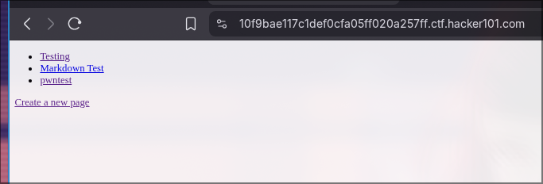
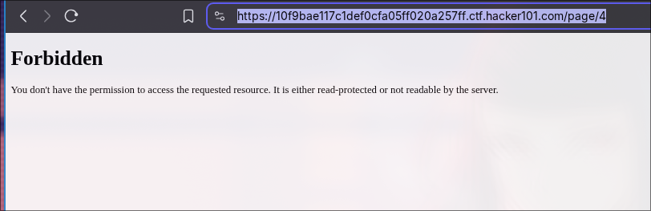
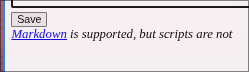
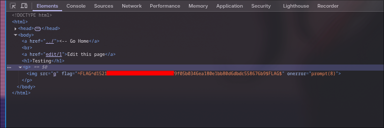
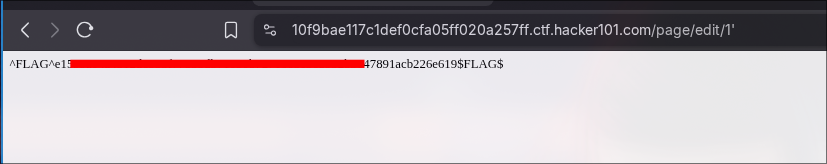
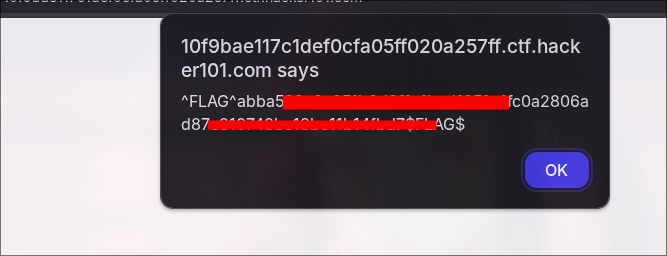

### Micro-CMS v1


So In this challenge, we need to find the 4 flags and submit it to h1ctf. Let's try to solve the chall.
Here is the first look when I spawn the chall.



We can edit the already posted readme and create another one. Let's try to create a new one. Here, I created one with `pwntest` and the interesting thing is the url for the post which is `page/9`
```js
https://10f9bae117c1def0cfa05ff020a257ff.ctf.hacker101.com/page/9
```
After that I tried to visit all the pages from 0 to 9. But we got a forbidden page for post 4. Interesting(noted).



There is written, script is not allowed, which I think we can trigger XSS by editing the markdown file. 



I searched for some payloads over github. I'm looking for something like marddown taks which can pop up XSS and found this payload. let's execute this.

```md

```

yup, we got the first flag.



Let's look for another, As mentioned earlier, we were facing `forbidden` at page `4`, let's try to edit the page instead of accessing it. yup, we got another flag.


Yup, I was trying to play with charectors like `", "+, '` and got the flag.



Now, for the last flag , I used 
```js
<script>alert(7*7)</script>
```
in the title section, and it gave me the final flag.

