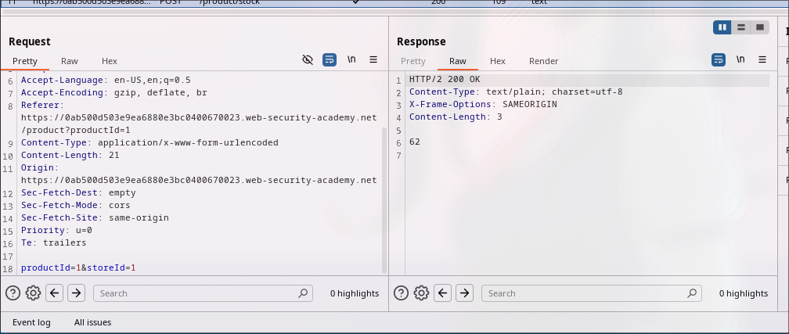
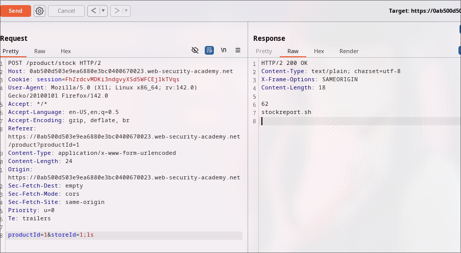
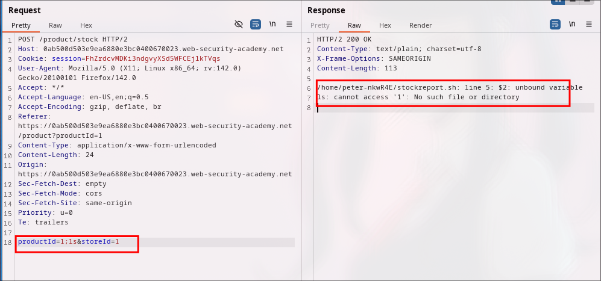
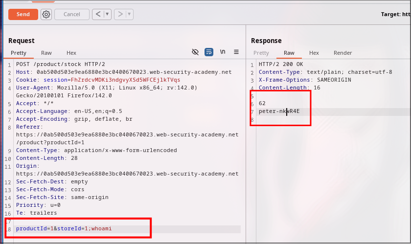

## OS command injection, simple case

This lab contains an OS command injection vulnerability in the product stock checker.

The application executes a shell command containing user-supplied product and store IDs, and returns the raw output from the command in its response.

To solve the lab, execute the `whoami` command to determine the name of the current user.

---

Let's try to solve the challenge. 

I spawn the challenge and try to look over every request and response in burp. As mentioned the vuln lies in stock checker, lets intercept the request and examine.

As you can it returns us the stock but let check which parameter is vulnerable [`productID` or `storeID`].

Yup, we can see there is `ls` command executed successfully, that means `storeID` parameter is vulnerable to injection. 

 

I have quickly checked the `productID` parameter, and seems its not vulnerable as it is showing `unbound variable 1`.

Let's execute `whoami` using `storeID` parameter now.

