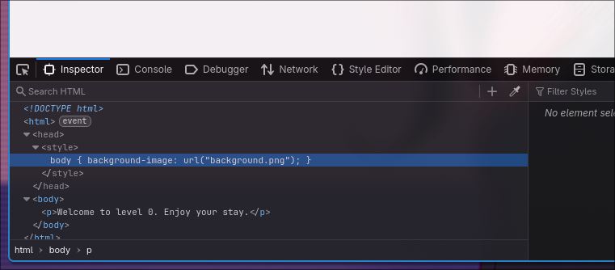
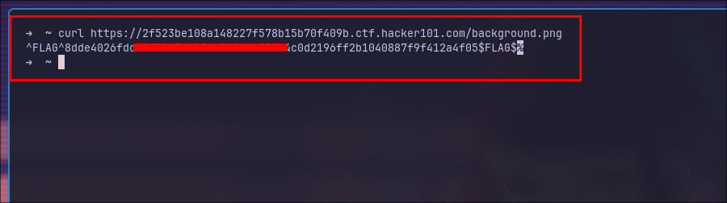

### A little something to get you started

Here is the initial look when I spawn the challenge. 

After looking into the source, I can see there is a `background.png` file ,

Let's try to access it. 

Here we got the flag. ease : )

